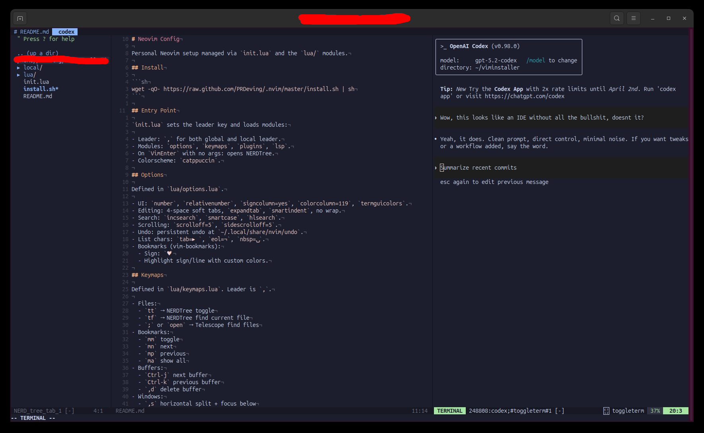

# Neovim Config

Personal Neovim setup managed via `init.lua` and the `lua/` modules.



## Install

```sh
wget -qO- https://raw.github.com/PRDeving/.nvim/master/install.sh | sh
```

## Entry Point

`init.lua` sets the leader key and loads modules:

- Leader: `,` for both global and local leader.
- Modules: `options`, `keymaps`, `plugins`, `lsp`.
- On `VimEnter` with no args: opens NERDTree.
- Colorscheme: `catppuccin`.

## Options

Defined in `lua/options.lua`.

- UI: `number`, `relativenumber`, `signcolumn=yes`, `colorcolumn=119`, `termguicolors`.
- Editing: 4-space soft tabs, `expandtab`, `smartindent`, no wrap.
- Search: `incsearch`, `smartcase`, `hlsearch`.
- Scrolling: `scrolloff=5`, `sidescrolloff=5`.
- Undo: persistent undo at `~/.local/share/nvim/undo`.
- List chars: `tab=▸ `, `eol=¬`, `nbsp=⍽`.
- Bookmarks (vim-bookmarks):
  - Sign: `♥`
  - Highlight sign/line with custom colors.

## Keymaps

Defined in `lua/keymaps.lua`. Leader is `,`.

- Files:
  - `tt` → NERDTree toggle
  - `tf` → NERDTree find current file
  - `;` or `open` → Telescope find files
- Bookmarks:
  - `mm` toggle
  - `mn` next
  - `mp` previous
  - `ma` show all
- Buffers:
  - `Ctrl-j` next buffer
  - `Ctrl-k` previous buffer
  - `,d` delete buffer
- Windows:
  - `,s` horizontal split + focus below
  - `,v` vertical split + focus right
  - `,c` close window
- LazyGit:
    - `,lg` opens/toggles LazyGit panel
- Codex:
  - `,cc` opens/toggles Codex agent panel
  - `,cq` closes Codex agent panel
- Misc:
  - `Q` disabled
  - `,p` paste from system clipboard

## Plugins

Managed with `lazy.nvim` in `lua/plugins.lua`.

- Theme: `catppuccin`
- UI: `lualine.nvim`
- Files: `preservim/nerdtree`
- Bookmarks: `vim-bookmarks`
- Fuzzy finder: `telescope.nvim` + `plenary.nvim`
- Git: `vim-fugitive` + `lazygit.nvim`
- LSP: `nvim-lspconfig`, `mason.nvim`, `mason-lspconfig.nvim`
- Completion: `nvim-cmp` + `cmp-nvim-lsp` + `cmp-buffer` + `cmp-path`
- Treesitter: `nvim-treesitter` (updates via `:TSUpdate`)
- Comments: `Comment.nvim`
- Multiple cursors: `vim-visual-multi`
- Copilot: `github/copilot.vim`

## LSP

Defined in `lua/lsp.lua`.

Uses Neovim 0.11+ built-in `vim.lsp.config` / `vim.lsp.enable`.

- Enabled servers: `lua_ls`, `ts_ls`, `pyright`, `gopls`
- Shared capabilities from `cmp_nvim_lsp`.
- LSP keymaps (buffer-local):
  - `gd` definition
  - `gr` references
  - `K` hover
  - `,rn` rename
  - `,ca` code action
